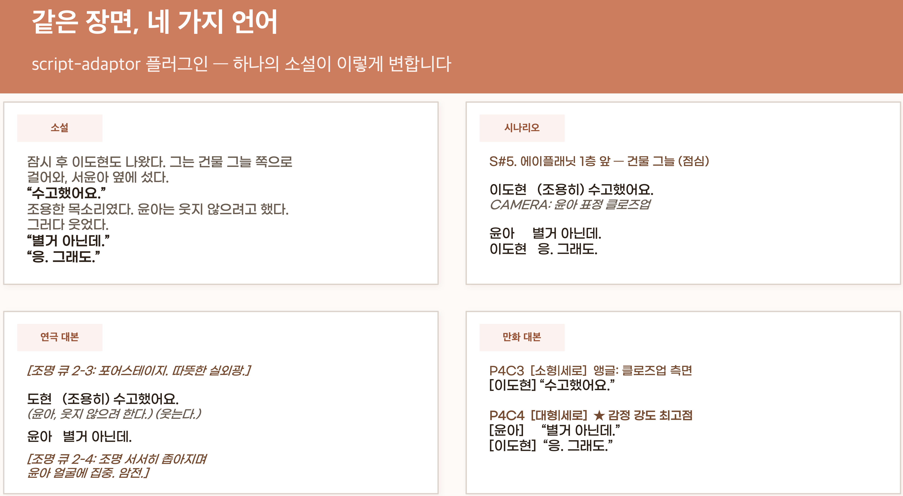

# 📜 script-adaptor

> 소설 한 편을 **영화 시나리오 · 연극 대본 · 만화 대본**으로 자동 각색하는 Claude Cowork 플러그인



---

## 이런 플러그인이에요

소설 원고(`novel-final.md`)를 넣으면, 멀티 에이전트 파이프라인이 각 형식의 문법에 맞게 자동으로 각색합니다.

같은 장면이 형식에 따라 이렇게 달라집니다.

| 형식 | 언어 |
|------|------|
| 소설 | 내면 묘사 · 산문 · 짧은 대화 |
| 영화 시나리오 | 씬 헤더 · 카메라 디렉션 · 대사 |
| 연극 대본 | 조명 큐 · 무대 지문 · 대사 |
| 만화 대본 | 페이지/컷 번호 · 앵글 · 말풍선 유형 |

---

## 지원 형식

- **영화 시나리오** — scene-planner → scene-writer → script-checker
- **연극 대본** — stage-planner → stage-writer → stage-checker  
- **만화 대본** — comic-planner → comic-writer → comic-checker

각 형식은 독립적인 에이전트 파이프라인으로 구성되어 있습니다.

---

## 설치

1. 레포 루트에서 `script-adaptor-vX.X.X.plugin` 다운로드
2. Claude Cowork → 설정 → 플러그인 → **파일로 설치**
3. 설치 완료

---

## 사용 방법

소설 초고를 `novel-final.md`로 저장한 뒤, Claude에게 말하세요.

```
"소설을 영화 시나리오로 각색해줘"
"연극 대본으로 만들어줘"
"만화 대본으로 각색해줘"
```

에이전트들이 순서대로 계획 → 집필 → 검수를 완료하면 각색 초고가 완성됩니다.

---

## 샘플

`sample/` 폴더에 "그때는 몰랐던 것들" (로맨스 소설 3화)을 각색한 결과물이 포함되어 있습니다.

| 파일 | 내용 |
|------|------|
| `01.그때는몰랐던것들_원본.pdf` | 소설 원본 |
| `02.그때는몰랐던것들_영화_시나리오.pdf` | 영화 시나리오 초고 |
| `03.그때는몰랐던것들_연극.pdf` | 연극 대본 초고 |
| `04.그때는몰랐던것들_만화계획서.pdf` | 만화 페이지/컷 계획서 |
| `04.그때는몰랐던것들_만화대본.pdf` | 만화 대본 초고 |

---

## 버전

`v0.7.5` · Claude Cowork 플러그인
